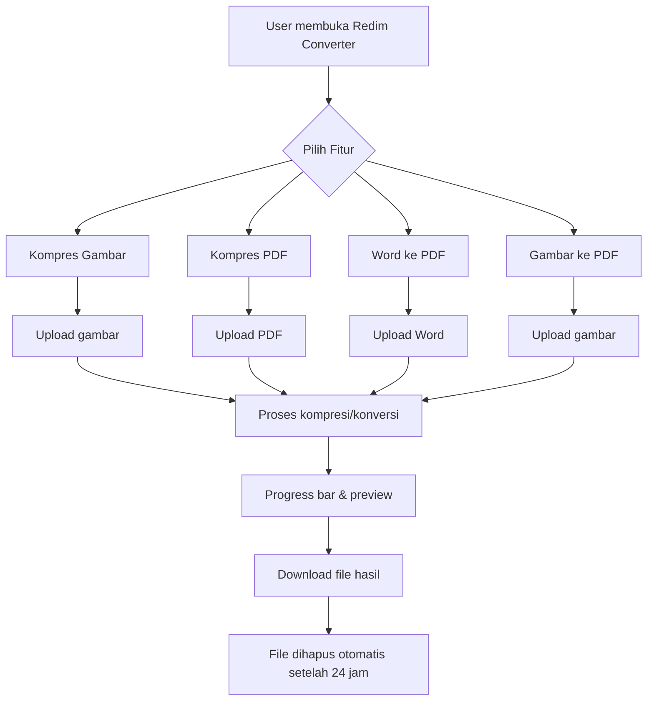
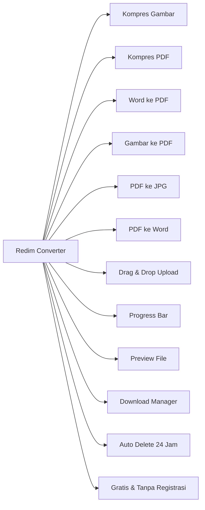

# 0. Use Case / Perancangan Aplikasi

**Redim Converter** adalah aplikasi web untuk kompresi dan konversi file (gambar, PDF, Word) secara online.
Aplikasi ini membantu pengguna:
- Mengurangi ukuran file agar mudah dikirim/email/upload.
- Mengubah format file sesuai kebutuhan (misal: Word ke PDF, gambar ke PDF).
- Menjaga privasi file (file dihapus otomatis setelah 24 jam).
- Tidak perlu instalasi, bisa diakses dari perangkat apa pun.

### Visualisasi Use Case

---

# 1. Nama Proyek / Aplikasi

**Redim Converter**  
Platform Kompresi & Konversi File Online

---

# 2. Fitur Utama

- **Kompres Gambar:** JPG, PNG, WebP (hingga 10MB/file)
- **Kompres PDF:** Optimasi ukuran PDF tanpa mengurangi kualitas
- **Konversi Word ke PDF:** .doc/.docx ke PDF
- **Konversi Gambar ke PDF:** Gabungkan beberapa gambar jadi satu PDF
- **(Opsional) PDF ke JPG, PDF ke Word:** Ekstrak halaman PDF ke gambar atau Word
- **Drag & Drop Upload:** Mudah upload file
- **Progress Bar:** Indikator proses real-time
- **Preview File:** Lihat file sebelum diproses
- **Download Manager:** Download hasil dengan mudah
- **Privasi:** File dihapus otomatis setelah 24 jam
- **Gratis & Tanpa Registrasi**

### Visualisasi Fitur Utama

---

# 3. Manual Book (Panduan Penggunaan)

## Langkah-langkah Umum:
1. **Buka aplikasi** di [http://localhost:8000](http://localhost:8000) atau domain Anda.
2. **Pilih fitur** yang diinginkan (misal: Kompres Gambar, Word ke PDF, dll).
3. **Upload file** dengan drag & drop atau klik tombol pilih file.
4. **Tunggu proses** kompresi/konversi (akan tampil progress bar).
5. **Download file hasil** melalui tombol yang tersedia.
6. **Ulangi** untuk file lain jika diperlukan.

## Tips:
- Pastikan ukuran file tidak melebihi batas maksimal (10MB).
- Untuk keamanan, file akan dihapus otomatis setelah 24 jam.

## Panduan Visual (User Flow)
Lihat diagram pada bagian Use Case di atas untuk alur proses penggunaan.

---

# 4. Tentang Kami & Pengembangan Aplikasi

Redim Converter dikembangkan oleh tim yang peduli pada kemudahan dan keamanan pengelolaan file digital.

- **Misi:** Menyediakan solusi kompresi & konversi file yang mudah, cepat, aman, dan gratis untuk semua orang.
- **Teknologi:** Laravel, Bootstrap, jQuery, dompdf, intervention/image, phpoffice/phpword, spatie/image-optimizer, dll.
- **Keamanan:** File Anda tidak disimpan permanen, dihapus otomatis setelah 24 jam.
- **Pengembangan:** Aplikasi terus dikembangkan untuk menambah fitur dan meningkatkan performa.

**Hubungi kami** melalui menu "Tentang Kami" di aplikasi untuk saran, kritik, atau kolaborasi.
